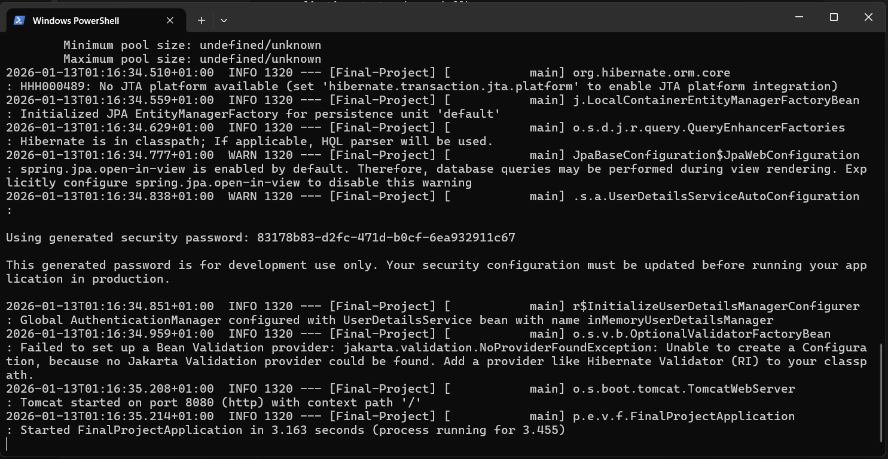
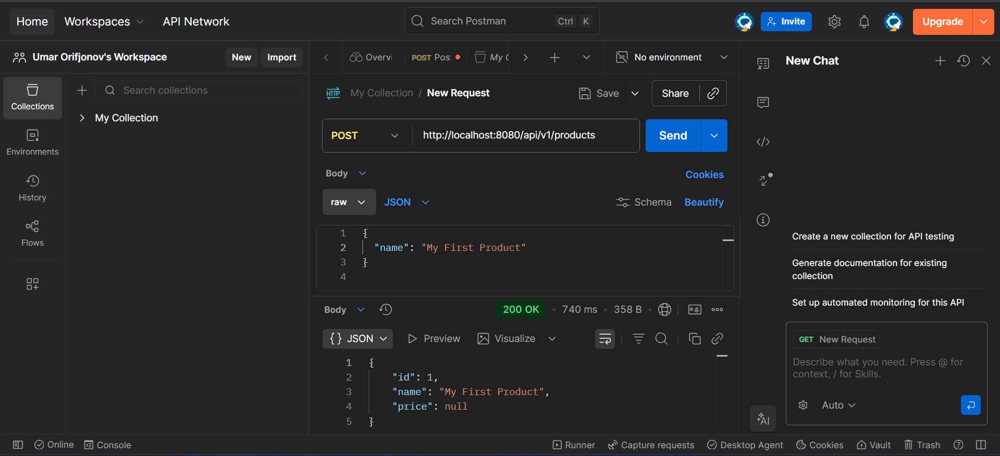
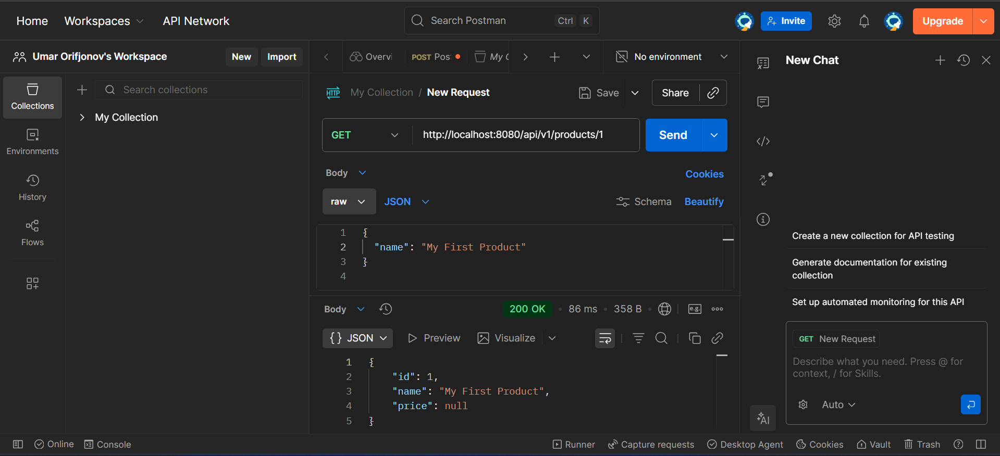
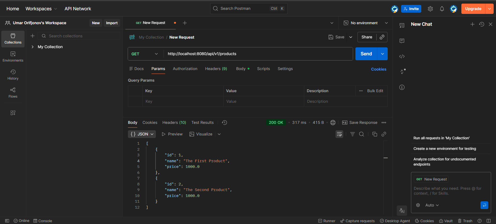
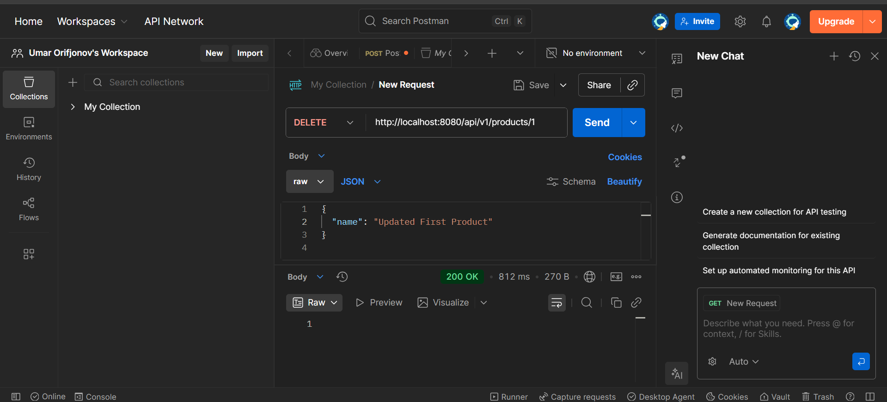
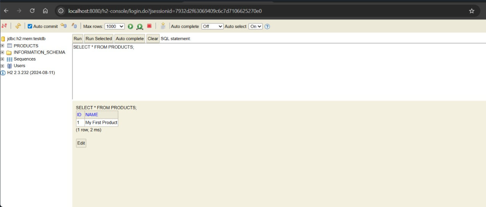

# Product Management System – REST API

## Description
Spring Boot REST API for managing products using layered architecture
(Controller, Service, Repository, Domain, Support).

## Technologies Used
- Java 17
- Spring Boot
- Spring Data JPA
- H2 In-Memory Database
- Postman (API testing)

## API Endpoints
- POST /api/v1/products
- GET /api/v1/products/{id}
- GETALL /api/v1/products
- PUT /api/v1/products/{id}
- DELETE /api/v1/products/{id}

### Application Startup (PowerShell)

The application was built and started using Maven Wrapper.

## Functionality Proof (Postman)

### Create Product

### Get Product by ID

### Get ALL Products

### Update Product

### Delete Product

### Database (H2 Console)

